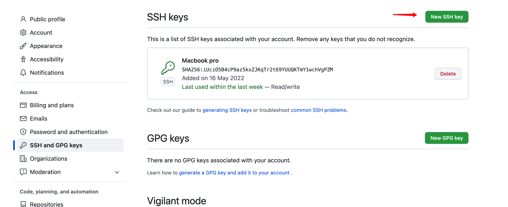

1. 在需要提交的项目根目录下，输入以下命令来设置名字和邮箱：
```shell
git config --global user.name "你的名字"
git config --global user.email "你的邮箱"
```
该处填写的名字和邮箱为github上的用户名和邮箱

2. 删除`.ssh`文件下的`know_hosts`
3. 生成公钥认证所需的公钥和私钥文件
```shell
ssh-keygen -t rsa -C "你的名字/你的邮箱"
```

之后会出现以下内容：
```shell
Generating public/private rsa key pair.
Enter file in which to save the key (/c/Users/Administrator/.ssh/id_rsa):
/c/Users/Administrator/.ssh/id_rsa already exists.
Overwrite (y/n)? y（输入y）
Enter passphrase (empty for no passphrase):（回车）

Enter same passphrase again:（回车）

```

此时再`.ssh`文件夹下生成了两个文件，`id_rsa`和`id_rsa.pub`， 用文本编辑器打开`id_rsa.pub`， 将内容复制到下面



4. 在Git中输入以下命令来检测是否与github连接成功：

```shell
ssh -T git@github.com
```