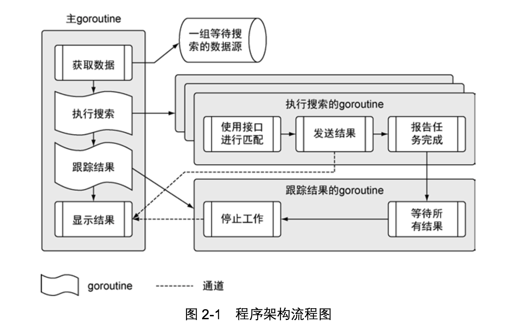

通过一个Go语言程序，来学习相应的语法规则。这个程序从不同的数据源拉取数据，并将数据内容与一组搜索项做对比，然后将匹配的内容显示在终端窗口上。

## 程序架构



项目结构：
```
sample
├── data
│   └── data.json
├── main.go
├── matchers
│   └── rss.go
└── search
    ├── default.go
    ├── feed.go
    ├── match.go
    └── search.go

```
`data.json`：包含一组程序要拉取和处理的数据源

`rss.go`：搜索rss源的匹配器

`default.go`：搜索数据用的默认匹配器

`feed.go`：用于读取json数据文件

`match.go`：用于支持不同匹配器的接口

`search.go`：执行搜索的主控制逻辑

`main.go`：程序的入口

## main包
```go
// main.go
package main

import (
	"log"
	"os"

	_ "./matchers"
	"./search"
)

// init 在main之前调用
func init() {
	// 将日志输出到标准输出
	log.SetOutput(os.Stdout)
}

// main是整个程序的入口
func main() {
	// 使用特定的项做搜索
	search.Run("president")
}
```

- 包：Go语言的每个代码文件都属于一个包，一个包定义一组编译过的代码，包的名字类似命名空间，可以用来间接访问包内声明的标识符。
  - 所有在同一个文件夹里的代码文件，必须使用同一个包名(包和文件夹同名)。
  - 标准库中导入代码时，只需要给出要导入的包名
  - 编译器查找第三方包的时候，会到`GOROOT`和`GOPATH`环境变量引用的位置去查找
- 导入：`import`就是导入一段代码，当你在其他地方实现了功能，你可以使用该方法将函数调用过来。
  - 第7行中存在一个`_`，可以让Go语言对该包做初始化操作，但是不导入包里的内容，该目的就是调用 matchers 包中的rss.go文件里的init函数
- init初始化函数：程序中每个代码文件里的`init`函数都会在main函数执行前调用
- main函数：在`main`函数中，调用了search包里的`Run`函数

## search包
这个包由4个不同的代码文件组成。

:::tip
首先理解什么是匹配器，匹配器，是指包含特定信息，用于处理某类数据源的实例。
:::

```go
// search/search.go
package search

import (
	"log"
	"sync"
)

// 注册用于搜索的匹配器的映射
var matchers = make(map[string]Matcher)

// Run执行搜索逻辑
func Run(searchTerm string) {
    // 获取需要搜索的数据源列表
	feeds, err := RetrieveFeeds()
	if err != nil {
		log.Fatal(err)
	}

    // 创建一个无缓冲的通道，用来接收匹配后的记过
	results := make(chan *Result)

	// 构造一个wait group， 用来处理所有的数据源。
	var waitGroup sync.WaitGroup

    // 设置需要等待的同奥
    // 每个数据源的goroutine的数量.
	waitGroup.Add(len(feeds))

    // 为每个数据源启动一个goroutine来查找结果
	for _, feed := range feeds {
        // 收到一个匹配用来查找
		matcher, exists := matchers[feed.Type]
		if !exists {
			matcher = matchers["default"]
		}

        // 启动一个goroutine来执行搜索
		go func(matcher Matcher, feed *Feed) {
			Match(matcher, feed, searchTerm, results)
			waitGroup.Done()
		}(matcher, feed)
	}

    // 启动一个goroutine来监控所有的工作是否完成了
	go func() {
        // 等待所有任务完成
		waitGroup.Wait()

        // 关闭通道的方式来执行显示函数，最后退出程序。
		close(results)
	}()

    // 显示结果
	Display(results)
}

// Register is called to register a matcher for use by the program.
func Register(feedType string, matcher Matcher) {
	if _, exists := matchers[feedType]; exists {
		log.Fatalln(feedType, "Matcher already registered")
	}

	log.Println("Register", feedType, "matcher")
	matchers[feedType] = matcher
}

```
- 变量：使用关键字`var`声明。
  - 变量没有定义在任何函数作用域内，就会被当成包级变量
  - 需要声明初始值的零值的变量，应该使用`var`关键字声明变量
- 声明运算符(`:=`)：这个运算符用于声明一个变量，同时给变量赋予初始值。
  - 编译器使用函数返回值的类型来确定每个变量的类型
  - 简化只是一种简化记法，如果提供非零值初始化变量或者使用函数返回值创建变量，应该是使用简化变量声明运算符(`:=`)。
- 当代码导入了一个包时，程序可以直接访问这个包中的任何一个公开的标识符。
  - 公开的这些标识符以大写字母开头，可以理解为public。
  - 小写字母开头的标识符就是不公开的，可以理解为private。
- 零值：所有变量都会被初始化为零值
  - 数值类型，零值为`0`
  - 字符串类型，零值为`""`
  - 指针，零值为`nil`
  - 引用类型，根据引用的底层数据结构进行初始化对应的零值
- 函数声明：使用关键字`func`声明函数，关键字后面紧跟着函数名， 参数和返回值
- 引用类型
  - 映射：`map`是Go语言中的一个引用类型，需要使用`make`来构造，而map变量的默认的零值为`nil`。
  - 切片：`slice`是一种实现了动态数组的引用类型
  - 通道：`channel`也是引用类型
- 一个函数可以返回多个值。一般像`RetrieveFeed`函数一样，一个函数返回一个值和一个错误值。

针对项目而言，在main函数返回后，整个程序就会终止，同时也会关闭之前启动但还在正常运行的goroutine。因此，在返回之前，清理并终止所有之前启动的goroutine
  - 使用`sync`包里的`WaitGroup`跟踪所有启动的goroutine
  - 其中`waitGroup`是一个计数信号量，用于统计所有的goroutine是不是完成了工作。当WaitGroup变量的计数值，当这个值减少为0时，所有的工作即完成了。


## RSS匹配器

## 总结